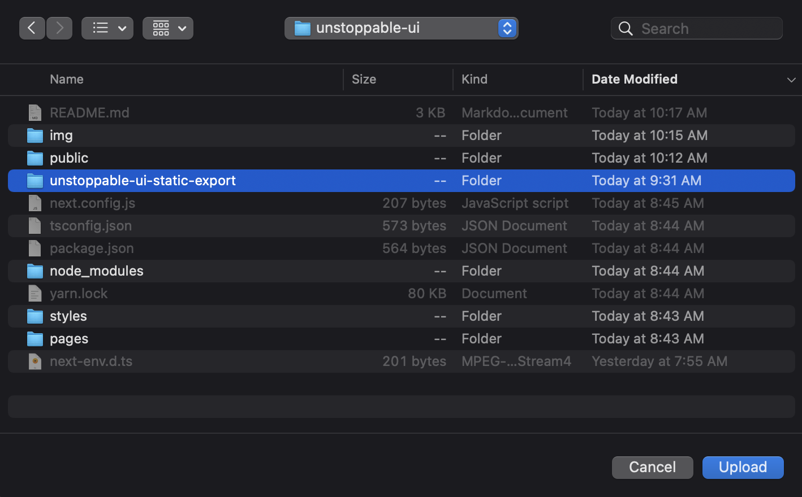

# Unstoppable Froge

Pronounced "frōg" as in "yogurt". This repo shows how to deploy a website to a ton of decentralized solutions so it will stay up.

<br/>
<p align="center">

</p>
<br/>

# Unstoppable Deployments

## How to View the site

[IPFS](ipfs://QmPL3uV44A8Njzcoezd3q7Kj5r2pGckY53fABLNyLvKqqg)
*This will last until no one pins it*

Filecoin: Deal Pending...
<!-- yarn ipfs-car --pack unstoppable-ui-static-export/ --output static-output.car  -->
*This will last till my X months deal is up*

[Arweave (Gateway)](https://arweave.net/0M0QZAG90JfEXvuJy05NxYhUg_-uEAjiToWdrTACQvo)
*This will last forever (or at least the location of the data at that hash, the gateway might go down)*

[Skynet (Gateway)](https://fg230g6kjiutm1su1ssn6d2mia78epolv3aq5g5n7sn695bubj96mb0.siasky.net/)
*This will only last a few months*

[Sia](sia://fAS_PYSikwSgq7SnNtkbK7mtCQX2y-X6OK6mYyRLX_E4IQ)
*This will last till my X months deal is up*

[Ethereum (NFT Address: 0xD8E1A2Bf94D72Cca7C6584B502FF05F618FCC509)](https://arbiscan.io/address/0xD8E1A2Bf94D72Cca7C6584B502FF05F618FCC509)
*This will last forever*

[ENS](https://unstoppablefrog.eth.link/)
*This will last until no one pins it or I forget to renew it in 30 years, but it has a Sia, Arweave, and ETH Address backup in the ENS text records*


# Table Of Contents

- [Unstoppable Froge](#unstoppable-froge)
- [Unstoppable Deployments](#unstoppable-deployments)
  - [How to View the site](#how-to-view-the-site)
- [Table Of Contents](#table-of-contents)
  - [How can we make a website unstoppable as f\*ck?](#how-can-we-make-a-website-unstoppable-as-fck)
- [Getting Started](#getting-started)
  - [Requirements](#requirements)
  - [Quickstart](#quickstart)
- [Unstoppableness](#unstoppableness)
  - [Export The Code](#export-the-code)
  - [IPFS](#ipfs)
    - [Upload to IPFS](#upload-to-ipfs)
    - [Bonus](#bonus)
  - [Filecoin](#filecoin)
    - [Upload to IPFS & Filecoin via FleekHQ](#upload-to-ipfs--filecoin-via-fleekhq)
    - [Bonus](#bonus-1)
  - [Arweave](#arweave)
    - [Upload to Arweave](#upload-to-arweave)
  - [Sia & Skynet](#sia--skynet)
    - [What is Sia?](#what-is-sia)
    - [What is Skynet?](#what-is-skynet)
    - [Upload to Sia](#upload-to-sia)
    - [Upload to Skynet](#upload-to-skynet)
  - [Ethereum](#ethereum)
- [Name Servers](#name-servers)
  - [Unstoppable Domains](#unstoppable-domains)
  - [ENS](#ens)
- [Censorship & Unstoppableness](#censorship--unstoppableness)
- [Other Considerations](#other-considerations)

## How can we make a website unstoppable as f\*ck?

1. Store UI on all decentralized storage
    1. IPFS
    2. Filecoin
    3. Arweave
    4. Sia
    5. Skynet
    6. Ethereum
2. Add Domain Namers
   1. ENS
   2. Unstoppable Domains
3. Store code on all decentralized git
    1. Radicle
    2. Sourc3
4. Add Logic to Smart Contract Platform (ETH)
    1. We don't have one, but this would be the easy part

# Getting Started

## Requirements

-   [git](https://git-scm.com/book/en/v2/Getting-Started-Installing-Git)
    -   You'll know you did it right if you can run `git --version` and you see a response like `git version x.x.x`
-   [Nodejs](https://nodejs.org/en/)
    -   You'll know you've installed nodejs right if you can run:
        -   `node --version`and get an ouput like: `vx.x.x`
-   [Yarn](https://classic.yarnpkg.com/lang/en/docs/install/) instead of `npm`
    -   You'll know you've installed yarn right if you can run:
        -   `yarn --version` And get an output like: `x.x.x`
        -   You might need to install it with npm

> If you're familiar with `npx` and `npm` instead of `yarn`, you can use `npx` for execution and `npm` for installing dependencies.

## Quickstart

1. Clone this repo, install dependencies.

```bash
git clone https://PatrickAlphaC/unstoppable-ui
cd unstoppable-ui
yarn
```

2. Check out the UI!

```
yarn dev
```

Open [http://localhost:3000](http://localhost:3000) with your browser to see the result.

# Unstoppableness

<br/>
<p align="center">
Un
</p>
<br/>

Get the joke?

## Export The Code

First, we need to create a static build of our app.

```
yarn next build
yarn export-ipfs
yarn export-relative-links
```

This will generate all the code we need in a folder named `unstoppable-ui-static-export` and `relative-links-output`.

## IPFS

IPFS stands for Interplanetary File Storage, and it's a way to store data to a network in a permissionless manner to a distributed and decentralized collective of IPFS nodes. When you upload a file you get a unique IPFS Hash that can only represents the data that was uploaded. Once uploaded, other nodes can "pin" that data, which is when these nodes cache the data themselves so that there are more copies of the data. 

IPFS doesn't have any data persistance guarantee, meaning IPFS nodes only pin data they care about and don't get paid to do so, but is a way to get a unique hash for a single piece of data. This means that if you point to an IPFS hash, at least 1 node has to host that data, or you'll get a blank page when looking it up. This also means that with this one hash, the *worst* that you can get is a blank page and never wrong data, since the hash can only point to the exact data that is associated with it. 

### Upload to IPFS

1. [Install IPFS](https://ipfs.tech/#install)

Install the [IPFS Desktop app](https://ipfs.tech/#install). You could install the IPFS command line too, but the desktop app is nice.

2. Open the app and click `import` -> `folder`

<p align="center">

</p>

3. Choose `unstoppable-ui-static-export` and hit `upload`

<p align="center">

</p>

You'll now have this folder on your IPFS node!

4. Pin it, share it with everyone and tell them to pin it.

You now have a CID with your pinned Website! Copy your CID from IPFS, and paste it into your browser with an `ipfs://` prefix.

If you have a IPFS enabled browser with something like [brave](https://brave.com/) or your browser has [IPFS Companion](https://chrome.google.com/webstore/detail/ipfs-companion/nibjojkomfdiaoajekhjakgkdhaomnch), you can go to the following URL in your browser:

```
ipfs://QmUrF435TTvK6wQGUEJ5W6mLTokyD98do2LHmPwk29amed
```

Or

```
ipfs://bafybeidaxlgco3us3dbs2svojipcfvwl4e6dwne3wohlhmxd2ozjdexbxy/
```

### Bonus

Ask centralized projects like [Pinata](https://www.pinata.cloud/) or [nft.storage](https://nft.storage/) to host your data on other IPFS nodes for some redundancy.

## Filecoin 

Now this is great! The next step on our journey is hosting to Filecoin. IPFS is great, but if we are the only node on the planet that is hosting the data, we could get shut down! So we need to have our data hosted on a decentralized blockchain that can't get shut down! So we want to store it on Filecoin.

Now... The raw saving to Filecoin... It's really hard right now. [You can follow these docs](https://lotus.filecoin.io/tutorials/lotus/store-and-retrieve/store-data/) to store data after running a Filecoin node. Just note, the Filecoin (lotus) node is... pretty big. 

They working on FVM to make this easier.

### Upload to IPFS & Filecoin via FleekHQ

Now the Filecoin deployment process can get... tricky. An easier way for us to deploy to Filecoin (but not censorship resistant!) is [FleekHQ](https://fleekhq.eth.link/).

Just follow their docs, deploy your code, and BOOM. You'll have a deal setup with IPFS & Filecoin! You'll need to integrate Github as well. I'm going going to go over it here since you should follow their docs.

For the build command, use:

```
yarn fleek-install && yarn build && yarn export-ipfs
```

For the publish directory, use:

```
unstoppable-ui-static-export
```

### Bonus

Right now, you can use centralized sites like [web3.storage](https://web3.storage/) or [nft.storage](https://nft.storage/) to help facilitate deals with Filecoin. 

## Arweave 

Arweave is the "nuclear" option, in the sense that all data is stored on Arweave chain. Sia & Filecoin store contracts and points to hosts hosting the data, the Arweave chain stores all the data.

Now this isn't to say that every node on the Arweave chain holds all the data, not quite. The Arweave network works by mining new blocks, and nodes get paid to mine these blocks. In order to mine the next block, they will need to have some random data the chain is looking for at the time of mint, if they don't have the data, they will have to get a new random number, which takes extra time meaning they will be slower to mine the block!

This also means, that each node is incentivized to store "rare" or not well duplicated data, since they will be quicker to mine blocks where the rare data is randomly chosen. 

### Upload to Arweave

To upload to Arweave, we are going to use `arkb`, which is a node-as-a-service tool for Arweave. Otherwise, we'd have to run our own node.

And I'm not setting up a 90TB node. 

1. Export another output

```
yarn build
yarn next export -o relative-links-output
```

2. Update to relative imports

Arweave can only understand relative imports. So, go into `index.html` of the `relative-links-output` file, and do a find & replace of `"/` with `"./`.

Then, update:

```
src="data:image/gif;base64,R0lGODlhAQABAIAAAAAAAP///yH5BAEAAAAALAAAAAABAAEAAAIBRAA7"
```

with

```
src="./lily-pad.png"
```

3. Get an arweave wallet/key

You can get some free [arweave for testing here.](https://faucet.arweave.net/) Then just save your json key to a file.

4. Deploy to arweave

```
yarn arkb deploy ./relative-links-output --wallet /path/to/wallet.json
```

[arkb](https://docs.arweave.org/developers/tools/textury-arkb)

## Sia & Skynet

### What is Sia?

Sia is a PoW blockchain that stores contract agreements with "Sia Hosts" that store your data. You can send a request to the sia blockchain which will split your data into many encrypted chunks and you can host the data on as many "hosts" as you like. This splitting up means hosts won't even be sure exactly what they are storing. You as a "renter" pay "hosts" Siacoin to store your data and you get to select as many hosts as you like for redundancy of data. Hosts put up some stake of Siacoin as a promise to host your data.

Hosts are challenges periodically by sending proof of storage to prove they have your data. 

### What is Skynet?

Right now, if you want to store data on Sia, you have to run a node, or figure out a way to setup a deal with the Sia blockchain. Skynet is the sort of RPC URL of Sia, where if you don't have your own node to facilitate transactions with, Skynet will do it for you. Skynet is a network where different people run their own "portal" to Sia. A portal is essentially their own Sia deal-making shop, and Skynet is the whole marketplace or mall. 

Skynet makes the process of making deals with Sia much easier, and helps facilitate working with Hosts. Skynet is a centralization vector, but they were working on making "portals" much easier to access even if that Skynet portal goes down. 

### Upload to Sia

1. Buy Siacoin

Siacoin is the L1 token that powers the Sia Chain.

2. Run a Sia node. 

You can run either the CLI or the [desktop app](https://docs.sia.tech/your-sia-wallet/sia-ui-faqs/how-to-download-and-install-sia-ui). You'll need at least 40 GB of space (maybe more depending on when you read this), and you'll have to wait a long time for it to get synced.

I'm using the UI for these instructions.

3. Rent from Hosts


### Upload to Skynet

Skynet is much easier. Skynet is the centralized eye into Sia. 

1. Build & Export the Site

```
yarn build
yarn next export -o relative-links-output
```

2. Drop the `relative-links-output` file the UI

Go to [skynet](https://skynetfree.net/) and drop your file into the UI. This will setup a 3 month contract for our site on Sia. 

Or, go to [skynet pro](https://skynetpro.net/) and setup an account to drop your file into. 

You can also run:

```
node upload-to-skynet.js
```

Which will also upload your site

## Ethereum

And finally, yes, we could even use ETH or any smart contract platform as a data storage system... but we'd probably spend a LOT of money. 

But I ended up deploying a really, really, crappy SVG based NFT to Arbitrum, so that's cool. It's also deployed sort of weird, so if you have [foundry](https://getfoundry.sh/) you can see the "site" easily by running:

```
cast call --rpc-url $ARBITRUM_RPC_URL 0xD8E1A2Bf94D72Cca7C6584B502FF05F618FCC509 "tokenURI(uint256)" 0 | cast --to-ascii
```

And you'll end this base64 encoded... "site".

```
data:application/json;base64,eyJuYW1lIjoiVW5zdG9wcGFibGVGcm9nIiwgImRlc2NyaXB0aW9uIjoiQW4gTkZUIHRoYXQgaGFzIGEgdG9rZW5VUkkgZm9yIGEgdW5zdG9wcGFibGUgd2Vic2l0ZSIsICJhdHRyaWJ1dGVzIjogW3sidHJhaXRfdHlwZSI6ICJjb29sbmVzcyIsICJ2YWx1ZSI6IDEwMH1dLCAiaW1hZ2UiOiJkYXRhOmltYWdlL3N2Zyt4bWw7YmFzZTY0LFBITjJaeUI0Yld4dWN6MGlhSFIwY0RvdkwzZDNkeTUzTXk1dmNtY3ZNakF3TUM5emRtY2lJSGh0Ykc1ek9uaHNhVzVyUFNKb2RIUndPaTh2ZDNkM0xuY3pMbTl5Wnk4eE9UazVMM2hzYVc1cklpQjNhV1IwYUQwaU5UQXdJaUJvWldsbmFIUTlJalV3TUNJK1BISmxZM1FnZDJsa2RHZzlJakV3TUNVaUlHaGxhV2RvZEQwaU1UQXdKU0lnWm1sc2JEMGlZbXhoWTJzaUlDOCtQSFJsZUhRZ2VEMGlNQ0lnZVQwaU1UVWlJR1pwYkd3OUluZG9hWFJsSWo1SklHRnRJR0oxZENCaElHaDFiV0pzWlNCbWNtOW5JUENma0xnOEwzUmxlSFErUEM5emRtYysifQ==
```

Where `ARBITRUM_RPC_URL` is your endpoint to arbitrum. 

# Name Servers

## Unstoppable Domains

So someone took [unstoppablefrog.crypto](https://ud.me/unstoppablefrog.crypto) already, so I didn't bother to buy one from there. 

## ENS

However, I was able to pick up [unstoppablefrog.eth]() from ENS for 30 years!


# Censorship & Unstoppableness

[Skynet (Sia)](https://support.skynetlabs.com/key-concepts/faqs#is-skynet-censorship-free)
[Skynet Podcast](https://soundcloud.com/themakerspodcast/censorship-resistance-sia-and-skynet-with-david)

# Other Considerations

[Storj](https://www.storj.io/): We didn't work with Storj since we couldn't find a way to connect with the network, host a node, or really much of anything without some kind of permissoned access.  

[0Chain](https://0chain.net/): We didn't work with 0Chain as it doesn't have a mainnet yet, but is an interesting project to keep your eyes on. 

We didn't go over hosting the code on a decentralized github as most of these are still in a beta stage right now, feel like there are a lot of developer experience enhancements to be made, and may change by the time this video comes out. 

[sourc3](https://www.sourc3.xyz/)
[radicle](https://app.radicle.network/)

Sia chain holds contract agreements & merkle roots of data. Hosts put up collateral to promise they will store the data. The renter has to rent from enough hosts to get paid. 